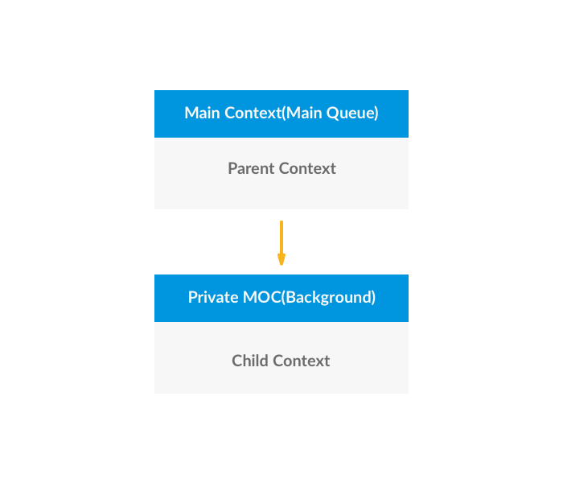

# CoreData - More on Contexts


## Objectives

- Learn about ManagedObjectContexts
- Discuss and use child contexts
- Discuss thread safety with ManagedObjectContexts

## ManagedObjectContexts & Concurrency

ManagedObjectContexts are not threadsafe. We have to use them with caution when concurrency is at play.

If we have multiple threads(main and some background thread for example) access the same ManagedObjects, we should have consistent behavior.

**Recomended Use of Contexts**

We use the main context for interacting with core data on the application's view layer.
But complex operation such as saving multiple ManagedObjects in core data take a long time and hence will block the main thread(if using main context).

What we want to do is hand off saves to a background context so write operations can be performed on the background.

### Problem: Fetching ManagedObjects from the main ManagedObjectContext & saving on a background Context

One way we can handle a save in this situation is to change the ManagedObjectContext.
Since fetching from the main context, all objects retrieved will be associated with the main managed object context.

**Option 1: Changing Contexts**
1. Grab the objectID from the ManagedObject. 
```swift
let objectID = myManagedObject.objectID
```
2. Fetch the same ManagedObject from the background ManagedObjectContext.
```swift
let myBackgroundManagedObject = coreDataStack.privateContext.object(with: objectID)
```
3. Do any modifications to your ManagedObject
4. Perform a save on the privateContext


**Option 2: Using Child Contexts**

## Child ManagedObjectContexts

You can set one ManagedObjectContext as a child to another.

To solve the problem of saving to a background context, we can create a new privateContext and set the main context as the parent.

1.
```swift
privateContext.parentContext = viewContext
```

2. Save
```swift
privateMOC.performBlock {
    // ... 
    // ....
    privateMox.save()
}
```

#### Contexts & Saves

*Notes*
When you save on the child context, changes don't persist until a save happens on the parent context.



### Using the private context with the PersistentContainer

The PersistentContainer makes dealing with private contexts easy.

The ```performBackgroundTask``` method of the PersistentContainer spins up a new private background context in a closure.


```swift
persistentContainer.performBackgroundTask { (context) in
    for object in objectArray {
        let mo = Inventory(context: context)
        mo.populateFromStruct(object)
    }
    do {
        try context.save()
    } catch {
        fatalError("Failure to save context: \(error)")
    }
}

```
